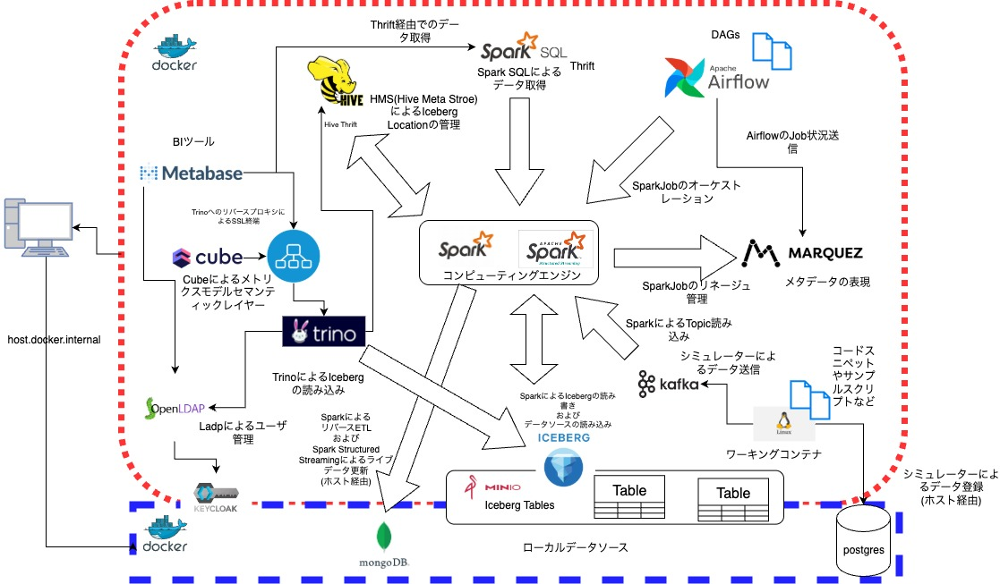

# S.A ローカルデータ分析基盤(data-platform-on-local)

全体像 : 
GitHubリポジトリ: [GitHub](https://github.com/yk-st/local-data-platform)

## ローカル環境について

本書では、基本的にローカル環境を中心として展開します。
クラウド環境も適宜紹介しますがローカル環境とクラウド環境の技術選定はできる限り一致させています。
他の類似技術スタックについては、1章のトップ画を参照してください。
利用技術やその詳細はリポジトリ内のREADME.mdを参照してください。