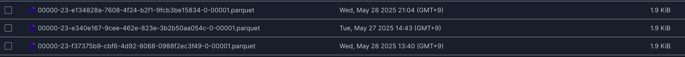
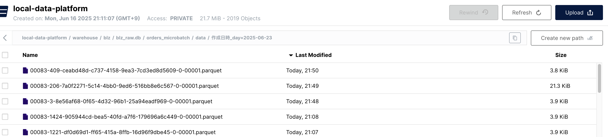
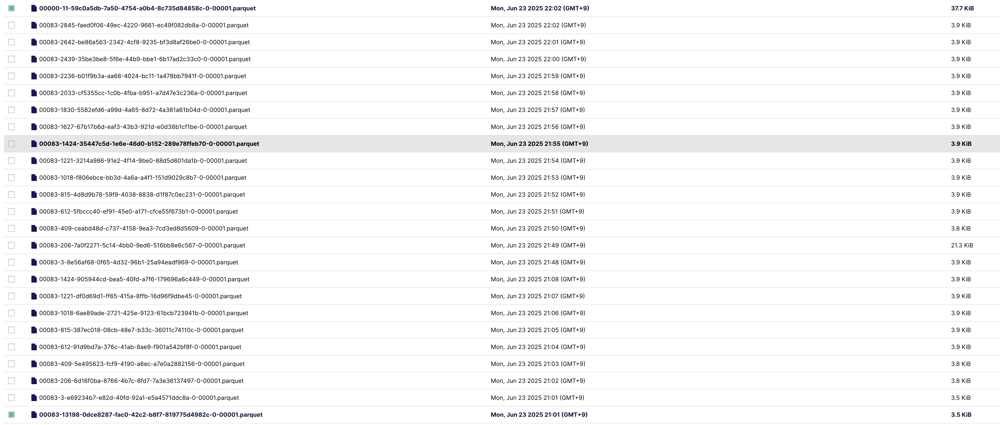

# S.B データ分析基盤のためのアプリケーション/ミドルウェアの基礎知識
本章では、データ分析基盤内で解説を進める際に必要な情報について整理を行います。
本書を読む上で必要な基本的なデータの操作方法を理解しておきましょう。本書ではローカルでの確認は基本的にDockerを使って確認をします。
全ての操作はワーキングコンテナで作業しています(A.A参照)。

## 0D.x Apache Sparkの基本操作を学んでおこう

### Spark
Apache Sparkは、メモリ指向で高速に大量データを処理できるオープンソースの分散処理エンジンです。
水平分割してスケールアウトによりTB級のバッチやストリーム処理を数十〜数百台のノードで高速にこなせるのがSparkの強みです。
統合型のコンピューティングエンジンとして、SQL、ML、(構造化)Streaming、グラフ処理など多様なAPIを1つのフレームワークの中に内包することで様々な
シーンへの対応が可能です。

本編で頻繁に利用する構文についてざっと速習しておきましょう。
本書では操作性と視認性の観点からPysparkおよびDataframeでの操作を基本とし、状況に応じてSQLによる操作も行います。

#### SparkSession

Sparkは、起動ごとにSparkSessionというオブジェクトを作成し、そのオブジェクトを通してSparkの機能を利用します。

```
from pyspark.sql import SparkSession

# Sparkセッションの構築
spark = SparkSession.builder \
    .appName("Spark Sample Application") \
    # ダイナミックアロケーションの有効化
    .config("spark.dynamicAllocation.enabled", "true") \
    # ダイナミックアロケーションの関連設定
    .config("spark.dynamicAllocation.minExecutors", "2") \
    .config("spark.dynamicAllocation.maxExecutors", "10") \
    .config("spark.dynamicAllocation.initialExecutors", "2") \
    # 必要に応じて他の設定を追加
    .enableHiveSupport() \
    .getOrCreate()

```

replの場合は起動時にsparkという名前でSpark Sessionが作成されます。
動作の設定はconfigで設定しますが本書ではspark-defaults.conf(data-platform-on-local/spark/conf/spark/spark-defaults.conf)で基本設定を行なっており、
特段の設定は不要です。ただし、必要に応じてconfigを上記の様な方式で設定を上書きして利用しています。

#### データフレームの作成
Sparkではデータをデータフレームという単位で処理します。
以下の様にデータフレームを手動で作成することも可能ですが、通常はテーブルやファイルから読み込むことが多いです。

```
from pyspark.sql import SparkSession
from pyspark.sql.types import StructType, StructField, StringType, IntegerType, FloatType

# SparkSessionの作成
spark = SparkSession.builder.appName("SampleDataFrame").getOrCreate()

# スキーマの定義
schema = StructType([
    StructField("employee_id", IntegerType(), True),
    StructField("name", StringType(), True),
    StructField("age", IntegerType(), True),
    StructField("department", StringType(), True),
    StructField("salary", FloatType(), True)
])

# サンプルデータの作成
data = [
    (1, "Alice", 30, "Sales", 4000.0),
    (2, "Bob", 35, "Sales", 5000.0),
    (3, "Charlie", 40, "HR", 4500.0),
    (4, "David", 28, "IT", 3500.0),
    (5, "Eve", 45, "HR", 5500.0),
    (6, "Frank", 50, "IT", 6000.0),
    (7, "Grace", 38, "Sales", 5200.0),
    (8, "Heidi", 26, "Marketing", 3000.0),
    (9, "Ivan", 34, "Marketing", 4000.0),
    (10, "Judy", 29, "IT", 3800.0)
]

# データフレームの作成
df = spark.createDataFrame(data, schema)

# データの表示
df.show()

+-----------+-------+---+----------+------+                                     
|employee_id|   name|age|department|salary|
+-----------+-------+---+----------+------+
|          1|  Alice| 30|     Sales|4000.0|
|          2|    Bob| 35|     Sales|5000.0|
|          3|Charlie| 40|        HR|4500.0|
|          4|  David| 28|        IT|3500.0|
|          5|    Eve| 45|        HR|5500.0|
|          6|  Frank| 50|        IT|6000.0|
|          7|  Grace| 38|     Sales|5200.0|
|          8|  Heidi| 26| Marketing|3000.0|
|          9|   Ivan| 34| Marketing|4000.0|
|         10|   Judy| 29|        IT|3800.0|
+-----------+-------+---+----------+------+

```

たとえば、以下はlocal_data_platform.ref.column_alias_mapというテーブルからデータを読み込んでdfという変数にデータフレームを格納しています。
この様に事前に定義したスキーマデータ経由で読み込む/書き込む方法をスキーマオンライトと呼びます。

```
df = spark.table("local_data_platform.ref.column_alias_map")
```

また、S3などのオブジェクトストレージから直接データを読み込むことも可能で、結果は同様にデータフレームがdfに格納されています。
この方法はスキーマオンリードと呼ばれ、データのスキーマとの合致をせずに書き込み/読み込みその後にスキーマを当てこむ様な方式です<fn>すごく厳密な話をすると、スキーマ経由でしかデータの読み込み/書き込み経路がないものがスキーマオンライトで、ストレージの直接読み込みなどスキーマ経由以外からもデータの読み込み/書き込み経路があるものはスキーマリードです。</fn>。

```data-platform-on-local/airflow/bundles/prod/scripts/jobs/init/zip_geocode.py

self.ZIP_GEOCODE_S3_SOURCE="s3a://data-source/ref/zip_geocode.csv"
  # S3上にあるCSVファイルの読み込み
  df = (
      spark.read
          .option("header", "true")
          .schema(schema)
          .option("encoding", "UTF-8")
          .csv(self.config.ZIP_GEOCODE_S3_SOURCE)
  )

※今回はCSV用の読み込み関数でしたが、他のフォーマット（Parquet、JSONなど）にも対応しています。

# Parquetファイルの読み込み
# df_parquet = spark.read.parquet("path/to/file.parquet")

# JSONファイルの読み込み
# df_json = spark.read.json("path/to/file.json")

※エンコーディングはUTF-8を指定していますが、必要に応じて他のエンコーディング（SJISなど）も指定できます。
#.option("encoding", "SJIS")

```

#### df.withColumn()/col()/alias()/select()/drop()

カラムの追加と選択を行うための関数を紹介します。

```
from pyspark.sql import functions as F

# 新しいカラムの追加(withColumn)
# カラムの指定(F.col)
df_with_bonus = df.withColumn("salary_with_bonus", F.col("salary") * 1.10)
# 別名の付与(alias)
# 対象項目の選択(select)
# 不要なカラムの削除(drop)
df_with_bonus = df_with_bonus.select(F.col("salary_with_bonus").alias("employee_salary"),F.col("salary")).drop("salary")

+------------------+
|   employee_salary|
+------------------+
|            4400.0|
|            5500.0|
|            4950.0|
|3850.0000000000005|
| 6050.000000000001|
| 6600.000000000001|
| 5720.000000000001|
|3300.0000000000005|
|            4400.0|
|            4180.0|
+------------------+

```

#### when()/otherwise()

条件分岐をおこなうための関数です。

```
from pyspark.sql import functions as F

# 給与に10%のボーナスを加算した新しいカラムを追加
df_with_bonus = df.withColumn("salary_with_bonus", F.col("salary") * 1.10)

# 結果の表示
df_with_bonus.select("name", "salary", "salary_with_bonus").show()


```

#### expr

テキストを評価できます。

```

# df.withColumn("salary_with_bonus", F.col("salary") * 1.10)に対して等価なexprを使った書き方
df_with_bonus_expr = df.withColumn("salary_with_bonus", F.expr("salary * 1.10"))

```

本書では、Data Contract利用時にDataframeのAPIはそのままテキスト表記で書けないのでexprを利用してSQLライクな表現をそのまま実行できる様にしています。

#### filter()/where()/limit

必要なデータを選択するための関数です。
分析観点で言えば、土日稼働していない場合のデータは除外するなどがある。

```
# 年齢が30歳以上の従業員をフィルタリング
# 上限は1件まで(limit)
df_over_30 = df.filter(df.age >= 30).limit(1)

+-----------+-----+---+----------+------+
|employee_id| name|age|department|salary|
+-----------+-----+---+----------+------+
|          1|Alice| 30|     Sales|4000.0|
+-----------+-----+---+----------+------+

```

#### join()

データフレーム同士を結合する関数です。innerやleftなど一般的な結合方法が利用可能です。

```
# 部署情報のデータフレームを作成
dept_data = [("Sales", "New York"), ("HR", "Chicago"), ("IT", "San Francisco"), ("Marketing", "Los Angeles")]
dept_schema = ["department", "location"]
df_dept = spark.createDataFrame(dept_data, dept_schema)

# 元のデータフレームと部署情報を結合(inner)
df_joined = df.join(df_dept, on="department", how="inner")

# 結果の表示
df_joined.select("name", "department", "location").show()

+-------+----------+-------------+                                              
|   name|department|     location|
+-------+----------+-------------+
|  Grace|     Sales|     New York|
|    Bob|     Sales|     New York|
|  Alice|     Sales|     New York|
|    Eve|        HR|      Chicago|
|Charlie|        HR|      Chicago|
|   Judy|        IT|San Francisco|
|  Frank|        IT|San Francisco|
|  David|        IT|San Francisco|
|   Ivan| Marketing|  Los Angeles|
|  Heidi| Marketing|  Los Angeles|
+-------+----------+-------------+

```

#### groupBy()/sum()/avg()/count()/last()/first()

集計を行うための関数です。

```
from pyspark.sql import functions as F

# 部署ごとにグループ化して平均給与を計算
df_avg_salary = df.groupBy("department").agg(F.avg("salary").alias("average_salary"))

# 結果の表示
df_avg_salary.show()

+----------+-----------------+
|department|   average_salary|
+----------+-----------------+
|     Sales|4733.333333333333|
|        HR|           5000.0|
|        IT|4433.333333333333|
| Marketing|           3500.0|
+----------+-----------------+

※他にもsumやcountなどの集計関数も利用可能です。

```

count()

```
# データフレームの総行数を取得
df.count()
10

```

firstとlastはそれぞれdataframeの最初と最後を取得する関数です。

```
from pyspark.sql import functions as F

# 部署ごとの最初と最後の給与を取得
df_first_last = df.groupBy("department").agg(
    F.first("salary").alias("first_salary"),
    F.last("salary").alias("last_salary")
)

# 結果の表示
df_first_last.show()

+----------+------------+-----------+
|department|first_salary|last_salary|
+----------+------------+-----------+
|     Sales|      4000.0|     5200.0|
|        HR|      4500.0|     5500.0|
|        IT|      3500.0|     3800.0|
| Marketing|      3000.0|     4000.0|
+----------+------------+-----------+

```

#### window()

ウインドウ関数を利用して、データのランキングや集計ができます。

```

from pyspark.sql.window import Window
from pyspark.sql import functions as F

# ウィンドウ関数の定義
window_spec = Window.partitionBy("department").orderBy(F.col("salary").desc())

# 部署ごとの給与ランキングを計算
df_ranked = df.withColumn("salary_rank", F.row_number().over(window_spec))

# 結果の表示
df_ranked.select("name", "department", "salary", "salary_rank").show()

+-------+----------+------+-----------+
|   name|department|salary|salary_rank|
+-------+----------+------+-----------+
|    Eve|        HR|5500.0|          1|
|Charlie|        HR|4500.0|          2|
|  Frank|        IT|6000.0|          1|
|   Judy|        IT|3800.0|          2|
|  David|        IT|3500.0|          3|
|   Ivan| Marketing|4000.0|          1|
|  Heidi| Marketing|3000.0|          2|
|  Grace|     Sales|5200.0|          1|
|    Bob|     Sales|5000.0|          2|
|  Alice|     Sales|4000.0|          3|
+-------+----------+------+-----------+

```


#### orderBy()

並び替えを行う関数です。

```
# 給与の高い順にソート
df_sorted = df.orderBy(F.col("salary").desc())

# 結果の表示
df_sorted.select("name", "department", "salary").show()

+-------+----------+------+
|   name|department|salary|
+-------+----------+------+
|  Frank|        IT|6000.0|
|    Eve|        HR|5500.0|
|  Grace|     Sales|5200.0|
|    Bob|     Sales|5000.0|
|Charlie|        HR|4500.0|
|   Ivan| Marketing|4000.0|
|  Alice|     Sales|4000.0|
|   Judy|        IT|3800.0|
|  David|        IT|3500.0|
|  Heidi| Marketing|3000.0|
+-------+----------+------+

```

#### timestamp()

時刻を操作するための関数です。

```
from pyspark.sql import functions as F

# 日付の文字列を含むデータフレームを作成
date_data = [("2023-01-01 10:00:00",), ("2023-06-15 15:30:00",), ("2023-12-31 23:59:59",)]
date_schema = ["date_string"]
df_dates = spark.createDataFrame(date_data, date_schema)

# 文字列をタイムスタンプ型に変換し、日本標準時に調整
df_with_jst = df_dates.withColumn(
    "timestamp_jst",
    F.from_utc_timestamp(F.to_timestamp(F.col("date_string"), "yyyy-MM-dd HH:mm:ss"), "Asia/Tokyo")
)

# Unixタイムスタンプを取得
df_with_unix_timestamp = df_with_jst.withColumn(
    "unix_timestamp_jst",
    F.unix_timestamp(F.col("timestamp_jst"))
)

# 結果の表示
df_with_unix_timestamp.show(truncate=False)

+-------------------+-------------------+------------------+
|date_string        |timestamp_jst      |unix_timestamp_jst|
+-------------------+-------------------+------------------+
|2023-01-01 10:00:00|2023-01-01 19:00:00|1672599600        |
|2023-06-15 15:30:00|2023-06-16 00:30:00|1686875400        |
|2023-12-31 23:59:59|2024-01-01 08:59:59|1704099599        |
+-------------------+-------------------+------------------+

```

#### UDF(User Defined Function)

ユーザが定義した関数を対象のカラムに対して適用できます。

```
from pyspark.sql.functions import functions as F
from pyspark.sql.types import StringType

# 年齢をカテゴリーに分類する関数を定義
def age_category(age):
    if age < 30:
        return "Young"
    elif 30 <= age < 40:
        return "Adult"
    else:
        return "Senior"

# UDFの登録
age_category_udf = F.udf(age_category, StringType())

# 新しいカラムをUDFを用いて追加
df_with_age_category = df.withColumn("age_category", age_category_udf(F.col("age")))

# 結果の表示
df_with_age_category.select("name", "age", "age_category").show()

+-------+---+------------+                                                      
|   name|age|age_category|
+-------+---+------------+
|  Alice| 30|       Adult|
|    Bob| 35|       Adult|
|Charlie| 40|      Senior|
|  David| 28|       Young|
|    Eve| 45|      Senior|
|  Frank| 50|      Senior|
|  Grace| 38|       Adult|
|  Heidi| 26|       Young|
|   Ivan| 34|       Adult|
|   Judy| 29|       Young|
+-------+---+------------+

```

#### repartition/coaleces()

処理しているファイルの塊の数を決定します。
Sparkではファイルの塊ごとに処理を行うため、合理的な分割は速度向上へ寄与します。

```
# パーティション数(並列して処理する単位)をage単位で4つに整理したあと2つに減少
# repartitionはデータのシャッフルを伴いデータを整理しながらパーティション数を変更える(e.g 指定したキーを同じパーティションにまとめて処理しやすくする)
# coalesceはシャッフルを伴わずにパーティション数を減少
df_coalesced = df.repartition(4, F.col("age")).coalesce(2)

# パーティション数の確認
print(f"coalesce後のパーティション数: {df_coalesced.rdd.getNumPartitions()}")

```

#### write()

ファイルを書き出すための関数です。

スキーマオンリード方式で、ストレージへ直接書き出し
```
# Parquet形式でデータを書き出し
# 圧縮形式はsnappy
df.write.parquet(
    "output/path/snappy_parquet_output",
    compression="snappy"
)
※他にもcsv、avro、json形式などで出力が可能です
※他の圧縮形式としては、gzip、bzip2なども利用可能です。

```

スキーマオンライト方式で、テーブルへ書き出し(モードはパーティションの上書き)
```
df.writeTo(config.get_dynamic_table_name(config.TABLE_USER_ORDERS_WIDE, args)).overwritePartitions()
```

なお、read時は圧縮形式を自動で判別しますので特段の指定は不要です。

### 単体テスト

```:target.py

from pyspark.sql import functions as F 

# pyspark関数
def age(birth_year_col: str, birth_month_col: str):
    return (
            F.year(F.current_date())
            - F.col(birth_year_col)
            - F.when(F.month(F.current_date()) < F.col(birth_month_col), 1).otherwise(0)
            ).cast("int")

※F.year,F.monthはそれぞれ与えられた日付から年と月を抜き出す
```

test/target.pyは、target.pyをテストするためのプログラムです。
流れとしては、test_dataをもとにデータフレーム(Sparkではデータフレームというテーブルのような単位でデータの変換を行っていきます。)であるdfを作成しています(①)。
②にてtarget.pyのage関数を呼び出し結果を取得(calc_age)
③にてcalc_ageとexpected_age(期待値)を比較し問題ないことを確認しています。

```:target.py
import pytest
from pyspark.sql import types as T
from datetime import datetime

class TestAge:
    @pytest.fixture
    def schema(self):
        schema = T.StructType([
            T.StructField(col_name, dtype)
            for col_name, dtype
            in (
                ("id", T.StringType()),
                ("birthday_year", T.StringType()),
                ("birthday_month", T.StringType()),
                ("values", T.IntegerType()),
            )
        ])
        return schema

    def test_age(self, spark_session, schema):
        from test.target import age
        # ①テストデータを作成
        test_data = (
            ("1", "1983", "2",  1),
            ("2", "1794", "5",  2),
            ("3", "1293", "6",  3),
            ("4", "1193", "11", 4),
            ("5", "2010", "2",  5)
        )
        # データフレームの生成
        df = spark_session.createDataFrame(test_data, schema)

        # ②target.pyのage関数を呼び出し(ただしSpakは遅延実行のためこの部分では実行されない※)
        # withColumnを利用してageというカラムをデータフレームにカラムを付与する
        df = df.withColumn("age", age("birthday_year", "birthday_month"))

        now = datetime.now()
        current_year = now.year
        current_month = now.month

        for _row in df.collect():
            _, _, birth_year, birth_month, _, calc_age = _row
            expected_age = current_year - int(birth_year) - (
                1 if current_month < int(birth_month) else 0)
            # ③結果の確認
            assert calc_age == expected_age, "Age calculation is incorrect"

※遅延実行（Lazy Execution）とは、Sparkの変換処理(たとえば、 df.withColumnのような)を即座には実行しないことです。
終端処理(collect(今回だと、for _row in df.collect():の部分)やcount()など)が呼び出された場合に、以前の部分も含めて実行する実行形態です。

```

### ライブラリとAPI
分散処理に対応している（Spark等の分散処理フレームワークにNativeに統合されている。もしくはライブラリとしてサポートしている）
というステータスはデータ処理を効率的に処理する上で非常に重要です。
選択の際は分散処理に対応しているかどうかを必ず確認しましょう。

いくつかのライブラリを紹介しておきます。

#### Sedona
分散処理に対応しておりマッピングサービス、物流、通信業界など、位置情報に関わる大規模データの分析に利用されます。
Sparkのストリーミング機能と組み合わせることで、リアルタイムの地理データ処理や解析も可能です。
https://sedona.apache.org/latest-snapshot/

#### Pandas Spark API
SparkからPandasへのAPIをそのまま利用できます。Pandasに対して分散処理によるスケーラビリティを提供します。
https://spark.apache.org/docs/latest/api/python/user_guide/pandas_on_spark/index.html

#### presidio
機密情報の検出とマスキングのためのライブラリです。
分散処理には直接的に対応していないので、UDFで対応します(UDFはより大規模なデータに対してパフォーマンスの問題が発生する可能性が高いため、use arrowオプションなどいくつかのパラメータと組み合わせることが推奨されます)。

https://microsoft.github.io/presidio/

#### Spark NLP
Spark NLPは、Apache Spark上で大規模に自然言語処理を行うためのライブラリです。
トークナイズ/品詞タグ付け/固有表現抽出などからBERT系モデルまでをパイプライン化して分散実行できます。
https://nlp.johnsnowlabs.com/

### Sparkにおけるアンチパターン

Sparkにおける代表的なアンチパターンを紹介しておきます。
少なくとも以下のパターンには必ず気をつけましょう。

#### Forループで一行ずつループする
Sparkのアンチパターンを公式サイトから抽出してくる
Forループが出てきたら要注意です。そのようなものではないということを覚えておきましょう。

```

from pyspark.sql import SparkSession

# Spark セッションの起動
spark = SparkSession.builder \
    .appName("SampleLoopAntiPattern") \
    .getOrCreate()

# サンプルデータの作成
data = [
    (1, "Alice", 100),
    (2, "Bob",   200),
    (3, "Carol", 300)
]
df = spark.createDataFrame(data, ["id", "name", "score"])

# アンチパターン: collect() して driver 上でループ
rows = df.collect()  # ① ドライバーに全件取り込む
for row in rows:
    # ② ループごとに別ジョブを発行してフィルタ＆collect()
    subset = df.filter(df.id == row.id).collect()
    print(f"id={row.id}, name={row.name}, score={subset[0].score}")

```

このパターンは致命的になります。

ループをやめて、データセットに対してネイティブの機能を利用して一括で処理するように変え変えます。

```

from pyspark.sql.functions import when, col

# たとえば、スコアを閾値で分類する処理を一括で実行
df2 = df.withColumn(
    "grade",
    when(col("score") >= 250, "A")
    .when(col("score") >= 150, "B")
    .otherwise("C")
)

df2.show()
# +---+-----+-----+-----+
# | id| name|score|grade|
# +---+-----+-----+-----+
# |  1|Alice|  100|    C|
# |  2|  Bob|  200|    B|
# |  3|Carol|  300|    A|
# +---+-----+-----+-----+

```

#### 特定のDriverやExecutorに負荷を寄せる処理

たとえば、repartition(1)やcoalesce(1)はExecutorに一度集めて処理するため、DriverやExecutorに負荷が集中します。
このような方式を多用するとデータの肥大化にともなって、メモリの増大で一時的にどうにかできても将来的には破綻しますので注意しましょう。

### Apache Iceberg
本節の内容は、Icebergの基本的な概念と操作方法を紹介します。
Icebergは、オープンテーブルフォーマットの一つであり、大規模なデータセットの管理とクエリ処理を効率化するための相互運用性を高めたフレームワークです。

理解のためには、ご自身のローカル環境(A.A参照)で手を動かしながら確認してみることを強くお勧めします。

#### Catalog/NameSpace/Table
Catalogというのは、メタデータの単位をまとめる単位のことです。

IcebergのようにCatalogを最上位としたモデルでは、カタログを切り出すことでdev/prodを分解できたりします。
データ分析基盤においては、データとメタデータが分離されていることが多いため、たとえば、データをコピーせずともメタデータのみをコピーして
論理的に別環境を作成するような作業が可能です。

**Tips**

オープンテーブルフォーマットを扱わない旧Hive環境ではhive.Database.Tableという形式でCatalog.NameSpace.Tableを表現していました。
つまり今まではカタログがhiveで固定でした。

```

>>> spark.sql("show catalogs").show()
+-------------------+
|            catalog|
+-------------------+
|local_data_platform|
|dev_local_data_platform|
|      spark_catalog|
+-------------------+

※spark_catalogはIceberg形式ではないテーブルを扱うためのカタログで過去の互換性のために存在しています。
※data-platform-on-local/spark/conf/spark/spark-defaults.confに今回利用するカタログの設定が記載されています。

```

#### 現在のカタログを確認する

```
>>> spark.sql("select current_catalog()").show()
+-------------------+
|  current_catalog()|
+-------------------+
|local_data_platform|
+-------------------+

```

#### ネームスペースを確認する

カタログの中にネームスペースを分けることで階層分けをします。

```
>>> spark.sql("show namespaces in local_data_platform").show()

+-------------+
|    namespace|
+-------------+
|blz_ingestion|
|      default|
|     gld_fund|
|     gld_mart|
|       legacy|
|          ref|
| slv_entities|
|     slv_fund|
+-------------+

```

#### ネームスペースの詳細を確認する

```
>>> spark.sql("describe namespace gld_mart").show(truncate=False)
+--------------+---------------------------------------------------+
|info_name     |info_value                                         |
+--------------+---------------------------------------------------+
|Catalog Name  |local_data_platform                                |
|Namespace Name|gld_mart                                           |
|Location      |s3a://local-data-platform/warehouse/gld/gld_mart.db|
|Owner         |airflow                                            |
+--------------+---------------------------------------------------+

```

#### DDLを発行してテーブルを作成する

ネームスペースの下にテーブルを作成が可能です。
テーブルの作成にはDDLを利用します。

```
spark.sql("""
  CREATE TABLE IF NOT EXISTS local_data_platform.blz_ingestion.users (
    `user_id`               STRING COMMENT 'ユーザーID',
    `address`               VARCHAR(255) COMMENT '住所',
    `email`                 VARCHAR(255) COMMENT 'メールアドレス',
    `password`              VARCHAR(255) COMMENT 'パスワード',
    `user_name`             VARCHAR(255) COMMENT 'ユーザー名',
    `acquisition_channel`   VARCHAR(255) COMMENT 'チャネル_取得元',
    `birth_date`            DATE COMMENT '生年月日',
    `zip_code`              CHAR(5) COMMENT '郵便番号',
    `created_at`            TIMESTAMP COMMENT '作成日時',
    `updated_at`            TIMESTAMP COMMENT '更新日時',
    `is_deleted`            BOOLEAN COMMENT '論理削除フラグ',
    `deleted_at`            TIMESTAMP COMMENT '論理削除日時',
    `ingest_date`           DATE COMMENT 'パーティション用追加列',
    `user_id_hash`          BIGINT COMMENT 'パーティション用追加列'
  )
  USING iceberg
  PARTITIONED BY (
    days(ingest_date),
    bucket(4, user_id_hash) -- 指定するカラムは数値型やdate timestamp型である必要があります
  )
  TBLPROPERTIES (
      'openlineage.dataset.namespace'='local_data_platform.blz_ingestion',
      'openlineage.dataset.name'='users',
      'write.format.default' = 'parquet',
      'format-version'       = '2',
      'write.distribution-mode'='hash',
      'write.target-file-size-bytes' = '268435456',
      'history.expire.max-snapshot-age-ms' = '2592000000',
      'history.expire.min-snapshots-to-keep' = '20'
  );
""")
```

Icebergでは以下のようなテーブルの属性定義(TBLPROPERTIES)もDDLでの定義が通例です。

- テーブルに対して1つのファイルをどれくらいでまとめるか(write.target-file-size-bytes)？
- スナップショットの保持期間や数をどうするか(history.expire.max-snapshot-age-ms(このミリ秒より古いスナップショットを削除), history.expire.min-snapshots-to-keep(最低保持スナップショット数))？

```
'write.target-file-size-bytes' = '268435456',
'history.expire.max-snapshot-age-ms' = '2592000000',
'history.expire.min-snapshots-to-keep' = '20'
```

あくまで、定義するだけで実際の書き込みやストアドプロシージャ（後続で確認）を実行する際にはこの部分を参照してこの定義通りに実行します。
よって、ここに記載しただけでは何も起きません。

**Tips**

USING icebergやUSING PARQUET以外にも、以下のようなDDLの形態を見る場合があります。
これは、serde形式での指定ですが Hive 0.x時代からあるMapReduce／Tez を前提にした旧 APIの名残で“HDFS 上のファイル ↔︎ 行／列オブジェクト” 変換プラグインのことです。
Serdeとはシリアライズ、デシリアライズの略で、ここではデータをParquetにする処理(シリアライズ)とParquetから可読可能な状態にする処理(デシリアライズ)のことを指します。

```

CREATE EXTERNAL TABLE  IF NOT EXISTS orders_parquet_serde (
..略
)
ROW FORMAT SERDE 'org.apache.hadoop.hive.ql.io.parquet.serde.ParquetHiveSerDe'
WITH SERDEPROPERTIES (
  'serialization.format'='1'
)
STORED AS
  INPUTFORMAT  'org.apache.hadoop.hive.ql.io.parquet.MapredParquetInputFormat'
  OUTPUTFORMAT 'org.apache.hadoop.hive.ql.io.parquet.MapredParquetOutputFormat'
LOCATION 's3://your-bucket/warehouse/orders_parquet/';

```

#### テーブル定義を確認する

```
>>> spark.sql("DESC local_data_platform.blz_ingestion.users").show(truncate=False, n=100)
+-------------------+-----------------------+----------------------+
|col_name           |data_type              |comment               |
+-------------------+-----------------------+----------------------+
|user_id            |string                 |ユーザーID             |
|address            |string                 |住所                  |
|email              |string                 |メールアドレス          |
|password           |string                 |パスワード           　 |
|user_name          |string                 |ユーザー名            　|
|acquisition_channel|string                 |チャネル_取得元       　|
|birth_date         |date                   |生年月日              |
|zip_code           |string                 |郵便番号              |
|created_at         |timestamp              |作成日時              |
|updated_at         |timestamp              |更新日時              |
|is_deleted         |boolean                |論理削除フラグ     　   |
|deleted_at         |timestamp              |論理削除日時         　 |
|ingest_date        |date                   |パーティション用追加列　　|
|user_id_hash       |bigint                 |パーティション用追加列　　|
|                   |                       |                      |
|# Partitioning     |                       |                      |
|Part 0             |days(ingest_date)      |                      |
|Part 1             |bucket(4, user_id_hash)|                      |
+-------------------+-----------------------+----------------------+

>>> 
※ DESC EXTENDEDにするとLocationなどより詳細な情報を確認できます。
```

#### テーブルを削除する

テーブルを削除可能です。

```
spark.sql("""drop table if exists local_data_platform.blz_ingestion.users""")
```

#### テーブルへの書き込み

本書で扱う主な書き込みのモードを復習しておきましょう。

**1. overwriteモードで書き込みを行う**

上書きは本書でも実務でも最も利用するモードです。

```
# 2) Iceberg テーブルへパーティション単位で上書き
df_raw.writeTo(self.target_table()) \
  .overwritePartitions()                  # ← ingest_date ごとに置換する
```

パーティションをingest_date(取り込み日時)とした場合に、
同日に2回動かせば、そのパーティションに対してのみ上書きが発生し2回目のデータを最新のスナップショットとして扱い1回目を過去のスナップショットとして扱います。

#### DMLの発行

Dataframeによる操作も可能ですが、Select/Insert/Update/Delete/Mergeも利用可能です。

```
spark.sql("""
  CREATE TABLE IF NOT EXISTS local_data_platform.blz_ingestion.users_min (
    id   BIGINT,
    name STRING
  )
  USING iceberg
  TBLPROPERTIES (
    'format-version'        = '2',
    'write.format.default'  = 'parquet'
  );
""")
```

**1. Select**

SQLライクなクエリでデータを操作可能です(spark-sqlと呼びます)。
データフレームAPIで操作できることはSQLでも操作可能です。

spark-sqlの場合

```
spark.sql("select * from local_data_platform.blz_ingestion.users_min").show()
```

spark-dataframe APIの場合

```
spark.read.table("local_data_platform.blz_ingestion.users_min").show()
```

いずれも結果は等価です。

**2. Insert**

テーブルにデータを挿入できます。

```
spark.sql("""
  INSERT INTO local_data_platform.blz_ingestion.users_min
  VALUES
    (1, 'Alice'),
    (2, 'Bob'),
    (3, 'Carol');
""")
```

**3. Delete**

テーブルの特定の行を削除できます。

```
spark.sql("""
  DELETE FROM local_data_platform.blz_ingestion.users_min
  WHERE id IN (2);
""")
```

**4. Update**

テーブルの特定の行を更新できます(delete+insertを発行している)。

```

spark.sql("""
  UPDATE local_data_platform.blz_ingestion.users_min
  SET name = CONCAT(name, '_v2')
  WHERE id = 1;
""")

```

```

>>> spark.sql("select * from local_data_platform.blz_ingestion.users_min").show()
+---+--------+
| id|    name|
+---+--------+
|  1|Alice_v2|
|  3|   Carol|
+---+--------+

```

**5. Merge**

Merge文を利用して、Upsert(レコードがあれば更新、なければインサート)や条件付きDeleteを実行できます。

```
spark.sql("""
  CREATE OR REPLACE TEMP VIEW src AS
  SELECT * FROM VALUES
    (1, 'Alice_v3', 'U'),   -- 既存行の更新（id=1）
    (3, NULL       , 'D'),  -- 既存行の削除（id=3）
    (5, 'Eve'      , 'I')   -- 新規挿入（id=5）
  AS src(id, name, op);
""")

```

Merge文(Upsert(レコードがあれば更新、なければインサート)/条件付きDelete)の発行。

```
spark.sql("""
  MERGE INTO local_data_platform.blz_ingestion.users_min t
  USING src s
  ON t.id = s.id
  WHEN MATCHED AND s.op = 'D' THEN DELETE
  WHEN MATCHED AND s.op = 'U' THEN
    UPDATE SET t.name = s.name
  WHEN NOT MATCHED AND s.op = 'I' THEN
    INSERT (id, name) VALUES (s.id, s.name);
""")
```

最終的なテーブルの内容は以下の通りです。
```
>>> spark.sql("select * from local_data_platform.blz_ingestion.users_min").show()
+---+--------+
| id|    name|
+---+--------+
|  1|Alice_v3|
|  5|     Eve|
+---+--------+

```

#### Icebergにおけるデータの保存構造

Icebergはテーブルのデータをストレージに保存します。
本書ではS3を利用していますが、HDFSやAzure Blob Storageなども利用可能です。

usersテーブルのデータ構造は以下のようになっています。

```

s3://local-data-platform/warehouse/ref/blz_ingestion.db/users/
├─ metadata/                                  # テーブルのメタ情報
│  ├─ 00000-...metadata.json                  # 過去メタデータ履歴(現在のヘッドも含む)
│  ├─ snap-1726xxxxxxxxx-1-xxxxxxxx.avro      # スナップショットごとのマニフェストリスト
│  ├─ xxxxxxxx-xxxx-xxxx-xxxx-xxxxxxxx-m0.avro# マニフェスト（データ/デリートファイルの索引）
└─ data/                                      # 実データ（write.format.default = parquet）
   ├─ ingest_date_day=2025-09-17/             # パーティション：days(ingest_date) の変換名 → ingest_date_day(ingest_dateを日単位に変換してくれる。テーブル列には出てこないためingest_date_dayは隠しパーティションと呼ばれる)
   │  ├─ user_id_hash_bucket=0/               # bucket(4, user_id_hash) → 0..3
   │  │  ├─ 00000-...-00001.parquet　　        # データファイル's(snapshot-x世代)
   │  │  └─ 00000-...-00002.parquet　　        # データファイル's(snapshot-x-1世代)
   │  ├─ user_id_hash_bucket=1/
   │  │  └─ 00000-...-00001.parquet
   │  ├─ user_id_hash_bucket=2/
   │  │  └─ ...
   │  └─ user_id_hash_bucket=3/
   │     └─ ...
   └─ ingest_date_day=2025-09-18/
      ├─ user_id_hash_bucket=0/
      ├─ user_id_hash_bucket=1/
      ├─ user_id_hash_bucket=2/
      └─ user_id_hash_bucket=3/

マニュフェストファイル:各データファイルのパス・パーティション値・統計量を数百～数千行ずつ保持する“索引ファイル”のことです。

```


このパーティション(ingest_date)でデータを絞り込むことをパーティションプルーニングと呼びます。

#### スナップショット(snapshot)

Icebergのデータはイミュータブルなデータ構造をとっています。
そのため、内部ではデータの更新があった際には新しいスナップショットを作成しポインタを最新ファイルに付け替えるという操作を実行します。

たとえば、1つのテーブルに対して3回Jobを走らせて書き込みをします。
その場合、スナップショットが以下の画像の様に3つのスナップショットが出来上がります。
この3つのうち時間の古い2つのデータは、毎度の書き込み時に削除されずスナップショット履歴として残っています。
ユーザーが対象のテーブルを検索する際は、とくに指定をしなければもっとも新しいスナップショットのデータを参照し返却します。


同一フォルダ内に複数のスナップショットに紐つくデータファイルが混在して配置されている。

最新のスナップショットに関するデータを取得する場合の内部の動きとしては、
metadata.jsonと呼ばれる管理ファイルを起点に、対象のスナップショットに紐つくデータを参照しユーザーに見せています。
※環境ごとに値は異なるのでご自身の環境で確認してみることを推奨します。

1. **metadata.jsonを読み込む**

メタデータ情報を読み込み、現在のスナップショットのIDを取得します。

```
current-snapshot-id=spark.read.json("s3a://local.data.platform/warehouse/gld/gld_mart.db/user_sales/metadata/00009-7c28165e-aead-434e-9bdc-67b583e8c2c6.metadata.json").select("current-snapshot-id").first()["current-snapshot-id"]

出力例：
current-snapshot-id:

3420590541306804416

```

2. **metadata.jsonのcurrent-snapshot-idをもとに、マニュフェストファイルがどれかを検索する**

```
spark.read.json("s3a://local-data-platform/warehouse/gld/gld_mart.db/user_sales/metadata/00009-7c28165e-aead-434e-9bdc-67b583e8c2c6.metadata.json").select("snapshots").show(truncate=False)
```

出力例：

3420590541306804416を含む列が現在のスナップショットを指し示すマニフェストリストファイル(avro)です。

```
略

{s3a://local-data-platform/warehouse/gld/gld_mart.db/user_sales/metadata/snap-773309095240151435-1-a5c633e2-3eb4-4e1b-b5d0-f8d1d7d3d61f.avro, 57644694762928420, 0, 8, 773309095240151435, {1, 1925, 60, app-20250528043618-0174, 1, 1, 60, spark, 3.5.5, Apache Iceberg unspecified (commit 7dbafb438ee1e68d0047bebcb587265d7d87d8a1), overwrite, 1912, app-20250528043618-0174, 1, 0, 0, 1925, 0, 60}, 1748406985062}, <-1世代前のスナップショット情報

{s3a://local-data-platform/warehouse/gld/gld_mart.db/user_sales/metadata/snap-3420590541306804416-1-a0611767-87f6-42ca-ac9b-50156dc76522.avro, 773309095240151435, 0, 9, 3420590541306804416, {1, 1930, 60, app-20250528044017-0179, 1, 1, 60, spark, 3.5.5, Apache Iceberg unspecified (commit 7dbafb438ee1e68d0047bebcb587265d7d87d8a1), overwrite, 1925, app-20250528044017-0179, 1, 0, 0, 1930, 0, 60}, 1748407224528}　, <-現在のスナップショット
略

```

**Tips**

今回は内部の理解のためにあえて自分で検索しましたが通常は探すのが大変なので、SQLでアクセスして対象のマニュフェストを探すのが通例です。

```
table_fqn = "local_data_platform.blz_ingestion.users"
manifest_path = (
    spark.sql(f"""
        SELECT manifest_list
        FROM   {table_fqn}.snapshots
    """)
    .first()["manifest_list"]
)

```

1. **マニュフェストリストファイルを読み込む**
マニュフェストリストファイルをavroを読み込む。

```
df = spark.read \
         .format("avro") \
         .load("s3a://local-data-platform/warehouse/gld/gld_mart.db/user_sales/metadata/snap-3420590541306804416-1-a0611767-87f6-42ca-ac9b-50156dc76522.avro") 

>>> df.select("manifest_path", "content").show(truncate=False)
+----------------------------------------------------------------------------------------------------------------------------+-------+
|manifest_path                                                                                                               |content|
+----------------------------------------------------------------------------------------------------------------------------+-------+
|s3a://local-data-platform/warehouse/gld/gld_mart.db/user_sales/metadata/a0611767-87f6-42ca-ac9b-50156dc76522-m1.avro        |0      |
|s3a://local-data-platform/warehouse/gld/gld_mart.db/user_sales/metadata/a0611767-87f6-42ca-ac9b-50156dc76522-m0.avro        |0      |
+----------------------------------------------------------------------------------------------------------------------------+-------+
※ MoR(ベースに対して差分を適用していく形式をMoRと呼ぶ。よって、ストリーミングの時など書き込みが激しい処理に用いられることが多い。)の場合はデルタファイルの管理として0,1,2が混在する。
 Contentの0は消されていないデータ２つのファイルを合わせたものがそのテーブルの実データ。
 そして、1,2は削除データとなる。０を読んだ後に1,2の削除分のデータを反映して表示する。今回は0のみなので単純２つを合わせたものがそのテーブルのデータの実体となる。
※ MoW(デルタとファイルを書き込み時に1つにしてしまう方法。つまり読み込みはMoRに比べて早いがデルタとファイルを書き込むため書き込みは遅い。
  Icebergのデフォルトモードはこちら)の場合はすべて0(まとめたものを吐き出すため)
※ テーブルのプロパティとして'write.merge.mode' = 'merge-on-read',
   'write.delete.mode' = 'merge-on-read'
   を設定するとMoRモードになる

```

マニュフェストファイルの一覧が出力されるため、次はその中のデータを参照する。

**- マニュフェストファイルの見込み(a0611767-87f6-42ca-ac9b-50156dc76522-m1.avro)**

マニュフェストファイルは、実データ（Parquet/ORC など）や delete ファイルのメタ情報を複数件まとめた Avroのこと。

```
df2 = spark.read \
         .format("avro") \
         .load("s3a://local-data-platform/warehouse/gld/gld_mart.db/user_sales/metadata/a0611767-87f6-42ca-ac9b-50156dc76522-m1.avro") 


+-----------------------------------------------------------------------------------------------------------------------------------------------------------------------------------------------------------------------------------------------------------------------------------------------------------------------------------------------------------------------------------------------------------------------------------------------------------------------------------------------------------------------+
|data_file                                                                                                                                                                                                                                                                                                                                                                                                                                                                                                              |
+-----------------------------------------------------------------------------------------------------------------------------------------------------------------------------------------------------------------------------------------------------------------------------------------------------------------------------------------------------------------------------------------------------------------------------------------------------------------------------------------------------------------------+
|{0, s3a://local-data-platform/warehouse/gld/gld_mart.db/user_sales/data/00000-23-f37375b9-cbf6-4d92-8068-0988f2ec3f49-0-00001.parquet, PARQUET, {}, 60, 1930, [{1, 144}, {2, 226}, {3, 105}, {4, 280}], [{1, 60}, {2, 60}, {3, 60}, {4, 60}], [{1, 0}, {2, 1}, {3, 0}, {4, 0}], [], [{1, [01 00 00 00]}, {2, [55 73 65 72 20 31]}, {3, [01 00 00 00 00 00 00 00]}, {4, [05 DC]}], [{1, [4B 04 00 00]}, {2, [55 73 65 72 20 39 37]}, {3, [04 00 00 00 00 00 00 00]}, {4, [0B 2E E4]}], NULL, [4], NULL, 0, NULL}|
+-----------------------------------------------------------------------------------------------------------------------------------------------------------------------------------------------------------------------------------------------------------------------------------------------------------------------------------------------------------------------------------------------------------------------------------------------------------------------------------------------------------------------+

実態のファイルの場所(data_file)が確認できたため、対象のファイルを読み込む
spark.read.parquet("s3a://local-data-platform/warehouse/gld/gld_mart.db/user_sales/data/00000-23-f37375b9-cbf6-4d92-8068-0988f2ec3f49-0-00001.parquet").show(n=2)

+-------+---------+-----------+-----------+
|user_id|user_name|order_count|total_sales|
+-------+---------+-----------+-----------+
|      5|   User 5|          2|    110.00 |
|     66|  User 66|          3|    215.00 |
+-------+---------+-----------+-----------+

```

m0も同様です。

```

df2 = spark.read \
         .format("avro") \
         .load("s3a://local-data-platform/warehouse/gld/gld_mart.db/user_sales/metadata/a0611767-87f6-42ca-ac9b-50156dc76522-m0.avro") 

spark.read.parquet("s3a://local-data-platform/warehouse/gld/gld_mart.db/user_sales/data/00000-23-6fde73ac-ccb0-4280-b234-e98ceafb5ae1-0-00001.parquet").show(n=200)

```

今回の場合は、contentがいずれも0なので単純に2つのマニュフェストファイルが指し示す実態のファイルの結果を合わせたものが、そのテーブルの最新のスナップショットデータとなる。
なお、m1,m0の粒度は manifest.target-size等いくつかの要因で変化する。

#### タイムトラベル
指定したその時点に一番近いスナップショットデータを表示します。
保持しているスナップショット時点まで遡ることができます。
通常スナップショットは世代を決めて( 'history.expire.min-snapshots-to-keep' = '20'などで)残す世代を決めるためスナップショットが消えてしまうと、
タイムトラベルクエリはその時点より前は表示できなくなります。

```

# 4026年なので実質現在時点
>>> spark.sql("select * from local_data_platform.gld_mart.user_sales TIMESTAMP AS OF '4026-10-26 01:21:00'").show(n=1)
+-------+---------+-----------+-----------+
|user_id|user_name|order_count|total_sales|
+-------+---------+-----------+-----------+
|     50|  User 50|          1|      51.00|
+-------+---------+-----------+-----------+
only showing top 1 row

```

#### ブランチング

Gitでソースコードを管理する様にデータに対してブランチを作成できます。
書き込む先は同じテーブルのロケーション内でブランチごとに別スナップショットで管理されます。
デフォルトのブランチはmainです<fn>https://iceberg.apache.org/docs/1.9.0/configuration/#table-behavior-properties</fn>。

1. **user_salesに対してdev_yukiブランチを作成する**

```
spark.sql("""
ALTER TABLE local_data_platform.gld_mart.user_sales
  CREATE BRANCH dev_yuki      -- 好きなブランチ名
""")

```

2. **ブランチを参照する**
作成したブランチで参照するにはテーブル識別子の末尾に .branch_<name> を付ける。

```
spark.sql("""
  SELECT * FROM local_data_platform.gld_mart.user_sales.branch_dev_yuki
  WHERE purchase_date >= '2025-05-01';
""")
```

3. **ブランチへ書き込む**

wapを設定することで、対象のブランチへ書き込みができます。

```
# W-A-P = Write - Audit - Publish
spark.conf.set("spark.wap.enabled",  "true")
spark.conf.set("spark.wap.branch",   "dev_yuki")

# あとは通常の書き込みと同じです。
# "local_data_platform.gld_mart.user_sales.branch_dev_yuki"でも可
df.writeTo("local_data_platform.gld_mart.user_sales").overwritePartitions()

```

この時点で、mainとdev_yukiのデータがそれぞれ存在することになります。

4. **ブランチを削除する**

```
ALTER TABLE iceberg_silver_prod.analytics.user_sales
  DROP BRANCH tmp_dev_yuki;
```

一点注意点としては、ブランチで対応するのはあくまでデータだけで、テーブル定義などの変更(ADD columns)**は全ブランチに影響を与えてしまいます**。

削除後はブランチが参照していたデータファイルはオーファンファイル(どこからも参照されなくなる)になるので、オーファンファイルの処理をする(次項)。

#### ストアドプロシージャ
ブランチを削除したりすることで不要となったファイルや、スナップショットを無限に溜め込んでいくと動作が遅くなったりと影響が出ます。
そのためテーブルのデータを適切にハウスキープする必要があります。ハウスキープの際によく利用する３つのプロシージャを紹介します。

また、ハウスキープ以外のプロシージャも用意されており本書で関係する(移行や復旧)他の3つのプロシージャも紹介します。

**1. スナップショットの削除**

スナップショットを永遠に溜め込むと、動作が遅くなったり不都合があるため定期的にスナップショットを削除する必要があります。
削除には以下の様なコマンドを発行するとテーブル定義DDLに指定したsnap-shot関連のプロパティ(history.expire.max-snapshot-age-msなど)に従ってスナップショットを削除してくれます。

```
spark.sql("""
CALL local_data_platform.system.expire_snapshots(
  table       => 'blz_raw.orders_microbatch'
)
""").show()

出力例
+------------------------+-----------------------------------+-----------------------------------+----------------------------+----------------------------+------------------------------+
|deleted_data_files_count|deleted_position_delete_files_count|deleted_equality_delete_files_count|deleted_manifest_files_count|deleted_manifest_lists_count|deleted_statistics_files_count|
+------------------------+-----------------------------------+-----------------------------------+----------------------------+----------------------------+------------------------------+
|                       1|                                  0|                                  0|                           1|                           2|                             0|
+------------------------+-----------------------------------+-----------------------------------+----------------------------+----------------------------+------------------------------+

この場合、スナップショットが1つ削除され(deleted_data_files_count)、マニフェストファイルが1つ削除され(deleted_manifest_files_count)、マニフェストリストが2つ削除(deleted_manifest_lists_count)されたという情報が出力されています。

※以下の様なパラメータを別で指定が可能です。
  older_than  => TIMESTAMP '2025-05-19 00:00:00',
  retain_last => 20
```

**2. マニフェストファイルのリライト**
マニュフェストが増えると書き込みジョブが走るたびに新しい manifest が増え、何千・何万個にも膨らむと、クエリごとに全部読み込むのに時間がかかるようになります。
また小ファイルデータが増えると manifest も増え、S3 GET が大量に発生→レイテンシが跳ね上がるため、定期的なマニュフェストおよびデータのコンパクション(≒マージ)が必須です。



<----マークがついているところがみれればいいので、間はある程度省略してOK
※ 他のファイルが残っているのはイミュータブルなのでデータ(過去スナップショット含む)は残っている。

```

-- 30 個以上の小ファイルが溜まったパーティションを 128 MiB で bin-pack
30未満の場合はスキップする。whereでコンパクションの対象をしぼりこむことが可能。

spark.sql("""
  CALL local_data_platform.system.rewrite_data_files(
    table    => 'local_data_platform.blz_raw.orders_microbatch',
    where    => '`processing_time` >= DATE \\'2024-05-23\\'',
    strategy => 'binpack',
    options  => map(
                'min-input-files','1',
                'target-file-size-bytes','134217728'
              )
  )
""").show(truncate=False)

# コンパクションする対象のデータ件数が出力される
+--------------------------+----------------------+---------------------+-----------------------+
|rewritten_data_files_count|added_data_files_count|rewritten_bytes_count|failed_data_files_count|
+--------------------------+----------------------+---------------------+-----------------------+
|11                        |1                     |78690                |0                      |
+--------------------------+----------------------+---------------------+-----------------------+
```

**3. オーファンファイルの削除**

ブランチの削除、スナップショットの削除、リライトによってどこからも参照されなくなったファイルを削除するためのプロシージャです。

```
from datetime import datetime, timedelta

ts = (datetime.utcnow() - timedelta(days=1)).strftime("%Y-%m-%d %H:%M:%S")

orphans = spark.sql(f"""
CALL local_data_platform.system.remove_orphan_files(
  table      => 'local_data_platform.blz_raw.orders_microbatch',
  older_than => TIMESTAMP '{ts}',
  dry_run    => true
)
""")

※ dry_runをfalseにすれば実際に消えます。

>>> orphans.show(truncate=False, n=6)
+----------------------------------------------------------------------------------------------------------------------------------------------------------------------------------------------+
|orphan_file_location                                                                                                                                                                          |
+----------------------------------------------------------------------------------------------------------------------------------------------------------------------------------------------+
|s3a://local-data-platform/warehouse/blz/blz_raw.db/orders_microbatch/data/%E4%BD%9C%E6%88%90%E6%97%A5%E6%99%82_day=2025-06-23/00083-13198-0dce8287-fac0-42c2-b8f7-819775d4982c-0-00001.parquet|
|s3a://local-data-platform/warehouse/blz/blz_raw.db/orders_microbatch/metadata/00000-281245aa-d0a5-42a8-add0-1198372aea25.metadata.json                                                        |
略
+----------------------------------------------------------------------------------------------------------------------------------------------------------------------------------------------+
```

コンパクションされ別のデータにマージされたことによって不要なデータが削除対象として出てきました。

これらのプロシージャは、週次や日次で行うケースが多いです。
日々の実行ごとにETL処理の最後に組み込みハウスキープを行います(同期実行ですので、Jobの時間が伸びます)。

**4. データ復旧のためのストアドプロシージャ(rollback_to_snapshot/rollback_to_timestamp)**

データに問題があった場合に、過去のスナップショットに戻すことができます。

```

# 直近のスナップショットを確認
spark.sql("""
  SELECT * FROM local_data_platform.blz_ingestion.users.snapshots;
""").drop("manifest_list","summary").show(truncate=False)

# スナップショットの履歴が確認できる
+-----------------------+-------------------+-------------------+---------+
|committed_at           |snapshot_id        |parent_id          |operation|
+-----------------------+-------------------+-------------------+---------+
|2025-09-05 11:50:59.028|7551751944446097857|NULL               |overwrite|
|2025-09-05 11:52:32.974|2660693776158621537|7551751944446097857|overwrite|
|2025-09-06 02:51:47.738|1503355708282744169|2660693776158621537|overwrite|
+-----------------------+-------------------+-------------------+---------+

# ブランチに紐ついているスナップショットを確認
spark.sql("""
  SELECT * FROM local_data_platform.blz_ingestion.users.refs;
""").drop("manifest_list","summary").show(truncate=False)

# 現在のスナップショット(1503355708282744169)がmainブランチに紐づいていることがわかる
+--------------+------+-------------------+-----------------------+---------------------+----------------------+
|name          |type  |snapshot_id        |max_reference_age_in_ms|min_snapshots_to_keep|max_snapshot_age_in_ms|
+--------------+------+-------------------+-----------------------+---------------------+----------------------+
|main          |BRANCH|1503355708282744169|NULL                   |NULL                 |NULL                  |
+--------------+------+-------------------+-----------------------+---------------------+----------------------+

spark.sql("""
  CALL local_data_platform.system.rollback_to_snapshot(
    'blz_ingestion.users', 2660693776158621537
  )
""").show()

# スナップショットが2660693776158621537に戻った
+--------------------+-------------------+
|previous_snapshot_id|current_snapshot_id|
+--------------------+-------------------+
| 1503355708282744169|2660693776158621537|
+--------------------+-------------------+

+--------------+------+-------------------+-----------------------+---------------------+----------------------+
|name          |type  |snapshot_id        |max_reference_age_in_ms|min_snapshots_to_keep|max_snapshot_age_in_ms|
+--------------+------+-------------------+-----------------------+---------------------+----------------------+
|main          |BRANCH|2660693776158621537|NULL                   |NULL                 |NULL                  |
+--------------+------+-------------------+-----------------------+---------------------+----------------------+

※ ロールバックなので元のスナップショット(1503355708282744169)へは戻せません。
※ タグ機能(後述)でスナップショットをバックアップとして残しておき、タグを指定してロールバックをロールバックすることは可能です。

```

rollback_to_timestampを利用すると、指定した日時に一番近いスナップショットに戻すことができます。

**5. ブランチ操作のためのストアドプロシージャ(fast-forward)**

ブランチのポインタを別のブランチに追随(fast-forward)させることができます。

```

# modify ブランチを作成
spark.sql("""
  ALTER TABLE local_data_platform.blz_ingestion.users
  CREATE BRANCH IF NOT EXISTS modify
""")

# modify ブランチのデータを更新
spark.sql("""
  UPDATE local_data_platform.blz_ingestion.users.`branch_modify` AS t
  SET t.address    = '神奈川県横浜市泉区4丁目15番4号（修正）',
      t.updated_at = current_timestamp()
  WHERE t.user_id = 1
""")

# 確認
spark.sql("select * from local_data_platform.blz_ingestion.users.branch_modify where user_id=1").show(truncate=False)
+-------+--------------------------------------+-----------------+--------+---------+-------------------+----------+--------+-------------------+--------------------------+----------+----------+-----------+-------------------+
|user_id|address                               |email            |password|user_name|acquisition_channel|birth_date|zip_code|created_at         |updated_at                |is_deleted|deleted_at|ingest_date|user_id_hash       |
+-------+--------------------------------------+-----------------+--------+---------+-------------------+----------+--------+-------------------+--------------------------+----------+----------+-----------+-------------------+
|1      |神奈川県横浜市泉区4丁目15番4号（修正）      |user1@example.com|pass1   |User 1   |Facebook           |1990-07-17|0051739 |2024-09-23 07:03:21|2025-10-31 08:53:44.460735|false     |NULL      |2025-09-05 |-928762887014768240|
+-------+--------------------------------------+-----------------+--------+---------+-------------------+----------+--------+-------------------+--------------------------+----------+----------+-----------+-------------------+

# この時点でのスナップショット
+--------------+------+-------------------+-----------------------+---------------------+----------------------+
|name          |type  |snapshot_id        |max_reference_age_in_ms|min_snapshots_to_keep|max_snapshot_age_in_ms|
+--------------+------+-------------------+-----------------------+---------------------+----------------------+
|modify        |BRANCH|362108662988014102 |NULL                   |NULL                 |NULL                  |
|main          |BRANCH|6829396665273549314|NULL                   |NULL                 |NULL                  |
|eod_2025-09-15|TAG   |1503355708282744169|NULL                   |NULL                 |NULL                  |
+--------------+------+-------------------+-----------------------+---------------------+----------------------+

# modifyをmainの先頭へfast-forward（＝mainをmodifyへ追随）

spark.sql("""
  CALL local_data_platform.system.fast_forward(
    table  => 'blz_ingestion.users',
    branch => 'main',
    to     => 'modify'
  )
""").show()

# mainブランチがmodifyブランチのスナップショット362108662988014102へ追随した
+--------------+-------------------+------------------+
|branch_updated|       previous_ref|       updated_ref|
+--------------+-------------------+------------------+
|          main|6829396665273549314|362108662988014102|
+--------------+-------------------+------------------+

# この時点でのスナップショット
+--------------+------+-------------------+-----------------------+---------------------+----------------------+
|name          |type  |snapshot_id        |max_reference_age_in_ms|min_snapshots_to_keep|max_snapshot_age_in_ms|
+--------------+------+-------------------+-----------------------+---------------------+----------------------+
|modify        |BRANCH|362108662988014102 |NULL                   |NULL                 |NULL                  |
|main          |BRANCH|362108662988014102 |NULL                   |NULL                 |NULL                  |
|eod_2025-09-15|TAG   |1503355708282744169|NULL                   |NULL                 |NULL                  |
+--------------+------+-------------------+-----------------------+---------------------+----------------------+
```


**6. データ移行のためのストアドプロシージャ(rewrite_data_files/rewrite_table_path)**

ストアドプロシージャはハウスキープだけでなく、
Hive形式のテーブル(e.g parquetなど)をIcebergに変換したり、Icebergのテーブルのファイルパスを変更したりするためのストアドプロシージャも用意されています。
テーブルの移行などを行う際に利用します。

rewrite_data_filesプロシージャを利用すると、同一環境であればフォーマットの変換が可能です。
以下はParquet形式のテーブル(legacy_fund_master)をIceberg形式に変換する例です。

```

spark.sql("""
  CALL local_data_platform.system.snapshot(
    source_table => 'spark_catalog.legacy.legacy_fund_master',
    table        => 'local_data_platform.blz_ingestion.legacy_fund_master_icb',
    properties   => map('format-version','2','write.format.default','parquet')
  )
""").show()

メタデータを移行(この時点ではデータは移動されません)
+--------------------+                                                          
|imported_files_count|
+--------------------+
|                   2|
+--------------------+

# データを移行
spark.sql("""
  CALL local_data_platform.system.rewrite_data_files(
    table   => 'blz_ingestion.legacy_fund_master_icb',
    strategy => 'sort',
    sort_order => 'fund_id ASC',
    options => map('rewrite-all','true')
  )
""").show()

# データがコピーされParqeut形式のテーブルがIceberg形式に変換されました
+--------------------------+----------------------+---------------------+-----------------------+
|rewritten_data_files_count|added_data_files_count|rewritten_bytes_count|failed_data_files_count|
+--------------------------+----------------------+---------------------+-----------------------+
|                         2|                     2|                 6276|                      0|
+--------------------------+----------------------+---------------------+-----------------------+

```

rewrite_table_pathプロシージャを利用すると、テーブルのロケーションを変更できます。
そのため環境間の移行などに利用できます。

#### タグ

タグを付けたスナップショットはGC対象外（expire_snapshots 実行時にも削除されない）になります。
特定の時点でデータを再現したい場合にタグ機能を利用すると便利です。

```
spark.sql("""
  SELECT snapshot_id
  FROM local_data_platform.blz_ingestion.users.snapshots
  ORDER BY committed_at DESC
  LIMIT 1;
""").show()

+-------------------+
|        snapshot_id|
+-------------------+
|2660693776158621537|
+-------------------+

# タグを付与
spark.sql("""
  ALTER TABLE local_data_platform.blz_ingestion.users
  CREATE TAG `eod_2025-09-15`
  AS OF VERSION 2660693776158621537
""")

※RETAIN 30 DAYS;などとすると期限付きで設定できます。

# タグを確認

spark.sql("""
  SELECT * FROM local_data_platform.blz_ingestion.users.refs;
""").show()

+--------------+------+-------------------+-----------------------+---------------------+----------------------+
|          name|  type|        snapshot_id|max_reference_age_in_ms|min_snapshots_to_keep|max_snapshot_age_in_ms|
+--------------+------+-------------------+-----------------------+---------------------+----------------------+
|          main|BRANCH|2660693776158621537|                   NULL|                 NULL|                  NULL|
|eod_2025-09-15|   TAG|2660693776158621537|                   NULL|                 NULL|                  NULL|
+--------------+------+-------------------+-----------------------+---------------------+----------------------+

-- タグ時点の状態で読みたい場合（タイムトラベル by tag）

spark.sql("""
  SELECT * FROM local_data_platform.blz_ingestion.users
  VERSION AS OF 'eod_2025-09-15';
""").select("user_id").show(n=1)

+-------+
|user_id|
+-------+
|      1|
+-------+

```

#### スナップショットメタデータ

snapshot-property.xを利用して書き込みのオプションに指定することで、書き込みのコミットで作られるスナップショットに対して、ユーザーやジョブIDなどのメタデータを付与できます。
スナップショットごとにメタデータを付与することで、後からメタデータを参照してアクションを起こすことが可能です。

```

rows = [(10, "Heidi"), (11, "Ivan")]
df = spark.createDataFrame(rows, "id BIGINT, name STRING")

(df.write
   .format("iceberg")
   .option("snapshot-property.af_dag_id", "aaaaaaaa-1111-2222-3333-xxxxxxxxxxxx")
   .option("snapshot-property.af_run_id", "bbbbbbbb-1111-2222-3333-xxxxxxxxxxxx")
   .mode("append")
   .save("local_data_platform.blz_ingestion.users_min"))

spark.sql("""
  SELECT snapshot_id,
         committed_at,
         operation,
         summary['af_dag_id'] AS af_dag_id,
         summary['af_run_id'] AS af_run_id
  FROM local_data_platform.blz_ingestion.users_min.snapshots
  ORDER BY committed_at DESC
  LIMIT 5
""").show(truncate=False)

# 最新の書き込みスナップショットにメタデータが付与されていることが確認できる
+-------------------+-----------------------+---------+------------------------------------+------------------------------------+
|snapshot_id        |committed_at           |operation|af_dag_id                           |af_run_id                           |
+-------------------+-----------------------+---------+------------------------------------+------------------------------------+
|1513370620415140161|2025-09-15 13:11:03.091|append   |aaaaaaaa-1111-2222-3333-xxxxxxxxxxxx|bbbbbbbb-1111-2222-3333-xxxxxxxxxxxx|
|8168081263948854028|2025-09-15 12:44:41.358|overwrite|NULL                                |NULL                                |
|4162810708882066117|2025-09-15 12:39:09.222|overwrite|NULL                                |NULL                                |
|6459537707201374780|2025-09-15 12:38:33.134|delete   |NULL                                |NULL                                |
|3355177050811583812|2025-09-15 12:37:04.086|append   |NULL                                |NULL                                |
+-------------------+-----------------------+---------+------------------------------------+------------------------------------+

```


## 0D.x 分散メッセージングシステムの基本操作を学ぼう

### Apache Kafka
分散メッセージングシステムとして今回はKafkaを利用します。
Apache Kafkaは、分散型のストリーミングプラットフォームであり、リアルタイムのデータストリームを処理するための強力なツールです。
Kafkaは、高い耐障害性とスケーラビリティを持ち、大量のデータを迅速に処理できます。

### KafkaとSpark Structured Streamingの連携

Kafkaへ送信されたデータをSparkで読み込みストリーミング処理が可能です。
※kafkaへの送信はシミュレーターを用いて行います(A.A参照)

```data-platform-on-local/working/programs/spark/streaming/spark_streaming.py
略
    # Kafka からストリーミング読み込み
    kafka_df = (spark.readStream
                .format("kafka")
                .option("kafka.bootstrap.servers",
                        "kafka1.local.data.platform:9093,kafka2.local.data.platform:9093")
                .option("subscribe", "orders_topic")
                .option("kafka.security.protocol", "SASL_PLAINTEXT")
                .option("kafka.sasl.mechanism", "PLAIN")
                .option("kafka.sasl.jaas.config",
                        'org.apache.kafka.common.security.plain.PlainLoginModule '
                        'required username="admin" password="admin";')
                .load())

略
    console_query = (parsed_df
                     .join(people_static, on="ユーザーID", how="left")
                     .withColumn("method", F.lit("Branch"))
                     .writeStream
                     .format("console")
                     .option("truncate", False)
                     .option("numRows", 20)
                     .option("checkpointLocation",
                             "s3a://process-bucket/checkpoints/orders_console")
                     .trigger(processingTime="60 seconds")
                     .start())
略

出力例
+-------+------------------------------------+----------+------------+-------+---------+--------+-----------+-------------------+-----------------------+--------+------------------------------+------+
|user_id|id                                  |product_id|subtotal_usd|tax_usd|total_usd|quantity|status_flag|created_at         |processing_time        |zip_code|address                       |method|
+-------+------------------------------------+----------+------------+-------+---------+--------+-----------+-------------------+-----------------------+--------+------------------------------+------+
|94     |275b8971-1009-4a37-9aa0-e6665fb8c63c|58        |2350.48     |235.05 |2585.53  |4       |NULL       |2025-09-11 01:33:22|2025-09-11 01:34:00.034|0033673 |大阪府大阪市住吉区5丁目3番47号    |Tee   |
+-------+------------------------------------+----------+------------+-------+---------+--------+-----------+-------------------+-----------------------+--------+------------------------------+------+

※SparkStreamingJobの起動は基本的にsupervisordなどでのデーモン化による起動が基本です。
```

formatをconsoleにすればコンソールに表示されるし、icebergにすればicebergの形式で保存されます。
Avroと連携する(avro形式でエンコードされたデータをavro形式でデコードする場合)際はfrom_avroを利用してデータをでデシリアライズして読み出します。

```
略
for ver, schema_json in schemas:
    with_payload = remain.withColumn(
        "payload",
        from_avro(F.col(bytes_col), schema_json, {"mode": mode})
    )
略
```

### Avroフォーマット

Avroフォーマットやプロトコルバッファーなどのフォーマットを分散メッセージングシステムの際に利用することでI/Oの効率化も期待できます。
Avroで指定可能なtypeはintやstringなど基本的な形式始め、enum/array/unionといったいくつかのリッチなフォーマットの利用が可能です。

<fn>https://avro.apache.org/docs/1.11.1/specification/</fn>
<fn>https://docs.confluent.io/platform/current/schema-registry/fundamentals/schema-evolution.html</fn>

代表的な型
array型
：["urgent","gift"]などの値

enum型
"symbols": ["NEW", "PROCESSING", "COMPLETED", "CANCELED"]

Union型
type:["null", "int"]のような表記をUnion型と呼びます。
互換としてnullを許容する場合は、Union型を使います。

defaultが設定されていない場合はすべて必須フィールドとなります。

```data-platform-on-local/kafka/init/avsc/order_event_v2.avsc
略
  "fields": [
    /* ─────────── IDs ─────────── */
    {
      "name": "id",
      "type": "string",
      "doc" : "UUID v4",
      "x-regex": "^[0-9a-f]{8}-[0-9a-f]{4}-4[0-9a-f]{3}-[89ab][0-9a-f]{3}-[0-9a-f]{12}$"
    },

    /* ─────────── User / Product ─────────── */
    { "name": "user_id",    "type": "int", "doc": "ユーザーID" },
    { "name": "product_id", "type": "int", "doc": "製品ID" },

    /* ─────────── 金額 (decimal) ─────────── */
    { "name": "subtotal_usd", "type": "double" },
    { "name": "tax_usd",      "type": "double" },
    { "name": "total_usd",       "type": "double", "cuallee:rule": "self == $.subtotal_usd + $.tax_usd" },

    /* ─────────── 個数 & フラグ ─────────── */
    { "name": "quantity", "type": "int", "doc": "数量（個）" },

    {
      "name": "status_flag",
      "type": {                /* Avro enum = 値集合を強制できる */
        "type": "enum",
        "name": "OrderFlag",
        "symbols": ["FLAG_0", "FLAG_1"]
      },
      "doc": "NORMAL=通常, CANCEL=取消"
    },
略

    { "name": "parent_id",
      "type": ["null","string"],         // Union型
      "default": null,                   
      "doc": "親注文 ID"
    }

略
```

### Schema Registry
Schema Registryはスキーマを管理するためのサービスです。

スキーマレジストリを配置する理由は物理的にファイルを配るのが大変だったり不可能だったりする場合があるためです。
そのため、そのような制限がない場合はスキーマレジストリを用意する必要はありません。asvcファイルはローカルでも読めるので
ファイルを配布すれば問題ありません。つまり、Consumer側がレジストリを使ってもいいし、Porducer側はローカルへのアクセスでも問題ありません。
<fn>より言えば、互換性をしっかりと確保していればスキーマレジストリが落ちていたら、フォールバックとして最低保証のスキーマファイルをローカルで読んで処理を継続するということもできます。</fn>

今回は、Kafkaのコンテナを起動するとスキーマレジストリに２つのバージョンのavsc(Avro Schema)が後方互換として登録されています<fn>kafka/init/initializer.sh参照</fn>。

V2においてはparentIDが追加された状態での登録です。
本書はこの前提で話を進めています。

### マイクロバッチとレコードバイレコード ...運用は複雑になりすぎない選択をしよう
レコードバイレコードはその名の通り1行づつ処理を行うことで、本当の意味でのストリーミング処理を行います。
マイクロバッチは、一定時間ごとにデータをまとめて処理する方式で、Sparkはこのマイクロバッチを主に採用しており本書での解説もこの形式に基づいています。

triggerやforeachBatchという表現が出てきますが、これは30秒ごとにその30秒間にきたデータをforeachBatchでの処理を意味します。
よって、データを1行ずつ処理するのではなく、30秒ごとにまとめて処理していることからマイクロバッチの形式に分類されます。

```マイクロバッチの表現例
  sliding_df.writeStream
  .foreachBatch(write_sliding)
  .trigger(processingTime="30 seconds")
```

実際の運用においては、多くの場合このマイクロバッチ形式で事足りることが多いです。Trigger間隔も例は30秒ですが、5秒程度にすることも可能です。
一方で、本書では扱いませんがマイクロバッチの様に数秒も待つことができない場合や、レコードバイレコードの処理が必要な場合は、Apache Flinkなどのよりリアルタイム性の高いストリーミング処理エンジンの利用を考えます。
