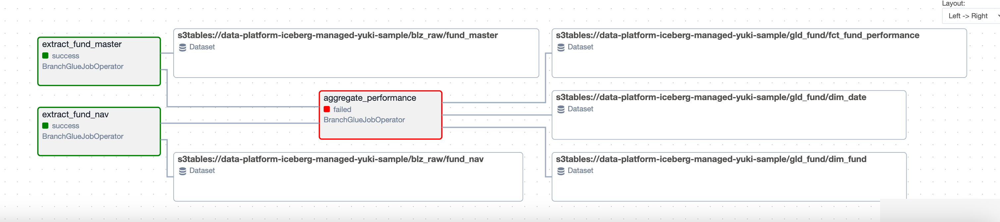
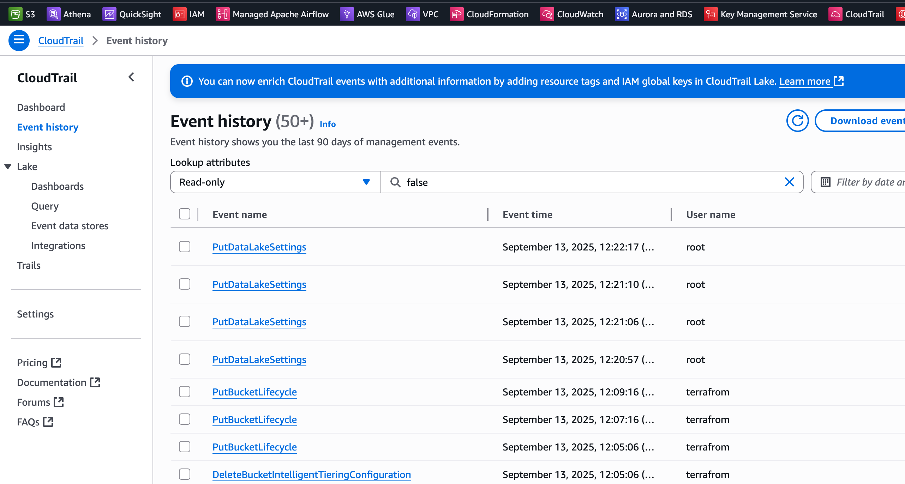

# S.D AWSクラウドにおけるデータ分析基盤と基本用語
※クラウドとは、とくに断りがない場合は「パブリッククラウド」を指します。
 パブリッククラウドは、インターネット経由で一般利用者向けに提供されるクラウドサービスを意味し、代表的なものにAWS、Azure、Google Cloudなどがあります。

GitHub: [data-platform-on-aws](https://github.com/yk-st/data-platform-on-aws)

## AWSクラウドの基本用語

AWSクラウドの基本用語を確認しておきましょう。

### コンピューティング/分析

データを処理する際に利用するコンピューティング/分析関連に関する基本用語です。

#### インスタンス
AWS の “インスタンス” は Amazon EC2 をはじめとする仮想サーバーのことを指し、必要なときに起動して使った分だけ課金されるオンデマンド型のコンピュートリソースです。
CPU・メモリ・ネットワーク帯域などをインスタンスタイプ単位で選べるため、バッチ処理からウェブアプリ、機械学習までワークロードに応じて最適化可能です。
多くのマネージドサービスの裏側としても利用されており重要なコンポーネントです。

https://docs.aws.amazon.com/AWSEC2/latest/UserGuide/concepts.html

#### Glue
AWS Glue は Spark 3 系（最新は 3.5 系）ベースのサーバーレス ETL/データ統合サービスです。
ジョブ／ワークフローの実行環境、Glue Data Catalog（メタストア）、クローラ、ノートブックなどをフルマネージドで提供し、コード（PySpark）、GUI（Glue Studio）、どちらでも開発できます

https://docs.aws.amazon.com/glue/latest/dg/what-is-glue.html

#### Athena
Amazon Athena はサーバーレスのインタラクティブクエリサービスで、S3 上のデータを ANSI SQL または Apache Spark コードで直接分析できます。
インフラ管理は不要で、課金はスキャン量（SQL）または実行時間/シャード数（Spark）ベースです。
Glue Data Catalog や Lake Formation と統合し、Iceberg/Hudi/Delta Lake など様々なテーブル形式を扱えます。

### ストレージ

データを保存する際に利用するストレージ関連に関する基本用語です。

#### S3
Amazon S3 は無制限スケールのオブジェクトストレージで、設計上 11 ナイン（99.999999999%）のデータ耐久性と 99.99% の可用性を提供します。
リージョン内 3AZ 以上へ自動多重化され、バケットポリシー／IAM／Lake Formation によりきめ細かなアクセス制御が可能。データレイクの “データ層” として事実上の標準になっています。

https://aws.amazon.com/s3/storage-classes/

#### S3 Tables
標準化された Iceberg REST Catalog API をマネージドエンドポイントとして提供しており、PyIceberg／Spark／Trino など Iceberg 対応エンジンから直接 CRUD が可能です。
メタデータはバケット内に保存され、参照インデックスとしてGlue Catalog や Lake Formation と組み合わせてガバナンスも一元化できます。

https://docs.aws.amazon.com/AmazonS3/latest/userguide/s3-tables-integrating-open-source.html

### アクセス制御

システムおよびインフラ管理者は、情報システムに対して業務上の必要性に基づく必要最小限のアクセスを実現するため、システムの用途や特性に合わせてネットワークを区分し、システムや端末を配置する。また、各情報システムにアクセスする業務上の必要性を有し、アクセスが認められたアカウントおよび当該アカウントが利用するシステムや端末等に対して、必要な権限を付与する。

#### IAM(RBAC/ABAC)
IAM ロールは「誰が何をできるか」を定義する RBAC の単位で、長期認証情報を持たず AssumeRole で一時的に引き受けられる ID です。
人やサービス、ワークフローが必要なときだけ権限を獲得できるため、最小権限・キー漏えいリスク低減を両立できます

https://docs.aws.amazon.com/IAM/latest/UserGuide/id_roles.html

#### Lake Formation
AWS Lake Formation は S3 上のデータレイクに対し、テーブル/列/行レベルできめ細かなアクセス制御を提供するデータガバナンスサービスです。

https://aws.amazon.com/jp/lake-formation/

### ネットワーク

ネットワーク関連の基本用語です。

#### VPC
仮想プライベートクラウド。CIDR やサブネット、ルートテーブル、NAT などを自由に構成してクラウド上に隔離されたネットワークを作れます。
Flow Logを利用することでVPC 内インターフェース間の IP トラフィックを CloudWatch Logs や S3 に記録し、トラブルシューティングやセキュリティ監査、コスト分析に活用できます。

https://aws.amazon.com/jp/vpc/

#### AZ(Availability Zone)
同一リージョン内で電源・ネットワークを独立させたデータセンター群です。
ワークロードを複数 AZ に配置することで、単一施設障害を吸収し高可用性を確保できます（RDS Multi-AZ など）。
https://docs.aws.amazon.com/AWSEC2/latest/UserGuide/using-regions-availability-zones.html

#### Private Link

AWS サービスや SaaS を インターネットを経由せず に自分の VPC へプライベート IP で引き込み、社内サービスのように利用できる仕組み。
トラフィックが AWS Backbone 内に閉じるため、セキュリティとレイテンシを両立できます。

https://docs.aws.amazon.com/vpc/latest/privatelink/what-is-privatelink.html

#### VPC エンドポイント
VPC から AWS サービスへ安全に接続するための Gateway（S3/DynamoDB 用）と Interface（PrivateLink ベース、多様なサービス用）の 2 タイプがあります。
インターネットゲートウェイや NAT を経由せずに通信できるため、プライベートサブネットでもセキュアに API を呼び出せます

https://docs.aws.amazon.com/whitepapers/latest/aws-privatelink/what-are-vpc-endpoints.html

### その他

その他関連する基本用語です。

#### コストエクスプローラー
サービス別・タグ別・期間別にコストと使用量を可視化するダッシュボード兼レポーティングツールです。
コストタグ（Cost Allocation Tags） を有効化すると、Project=analytics など任意のキー／値でリソースを分類し、月次・日次 CSV／Parquet レポートやインタラクティブグラフでコストを集計できます。

https://docs.aws.amazon.com/awsaccountbilling/latest/aboutv2/cost-alloc-tags.html

#### Cloud Watch
Amazon CloudWatch は、AWS 全体のメトリクス監視、ログ管理、アラーム発報、分散トレース、ダッシュボード可視化を 1 つのサービスでまかなえる観測機能です。
標準やカスタムのメトリクスを最短 1 秒粒度で収集し、同じ画面上でアプリケーション/システムのログを検索・分析できます。
メトリクスや Logs Insights のクエリ結果にしきい値を設定すれば、SNS トピックや OpsCenter に自動通知され、インシデント対応を迅速化できます。

https://aws.amazon.com/about-aws/whats-new/2025/01/amazon-cloudwatch-allows-alarming-data-7-days-old/

#### KMS
AWS Key Management Service (KMS) は、暗号鍵の作成・管理・使用を安全に行うためのフルマネージドサービスです。  
データの暗号化やデジタル署名に利用され、AWS サービスやアプリケーションから簡単にアクセスできます。  
KMS は、顧客が管理するカスタマーマスターキー（CMK）と、AWS が管理するサービスマスターキーをサポートしています。

https://aws.amazon.com/jp/kms/

#### MWAA(Amazon Managed Workflows for Apache Airflow)
MWAAは Apache Airflow をフルマネージドで提供するサービスで、環境のプロビジョン・スケーリング・パッチ適用を AWS が代行します。

https://docs.aws.amazon.com/mwaa/latest/userguide/airflow-versions.html

#### CloudTrail
CloudTrail は AWS アカウント内の API コールを記録し、監査・コンプライアンス・運用トラブルシューティングに活用できるサービスです。

### クラウドでセキュアにインフラ構築する際の基本ポイント

ネットワーク関連とEC2関連のみなどできる限り少なめでを紹介します。

| カテゴリ                | 実施ポイント                                          | サマリ                                                                                        |
| ------------------- | ----------------------------------------------- | ------------------------------------------------------------------------------------------ |
| **ネットワーク隔離**        | **VPC エンドポイント (Gateway / Interface)**           | S3 や DynamoDB、Glue、Athena などへの呼び出しを **NAT・IGW を経由せず** VPC 内で完結。内部トラフィックのみでデータ転送し、外部露出を最小化。 |
| **アイデンティティ & アクセス** | **IAM ロールの最小権限設計 (RBAC/ABAC)**                  | EC2 ⇔ S3／Athena 等のアクセスは *インスタンスロール* 経由で短期認証。タグベース ABAC で自動的に権限を付与／剥奪。                      |
| **暗号化**             | **S3**                      | デフォルト暗号化を有効化し、KMS CMK でキー管理。バケットのパブリックアクセスはしない。                  |
| **ネットワーク制御**        | **セキュリティグループ／NACL**                             | *アウトバウンド＝完全拒否* を基本線とし、アプリが必要とする先（VPC エンドポイント）だけを許可。                                        |
| **監査**            | **CloudTrail＋VPC Flow Logs**                    | API コール（権限逸脱）とトラフィック異常（不正ポート／AZ 跨ぎ通信）を一元監査。Athena でクエリ & Lake Formation でガバナンス。            |
